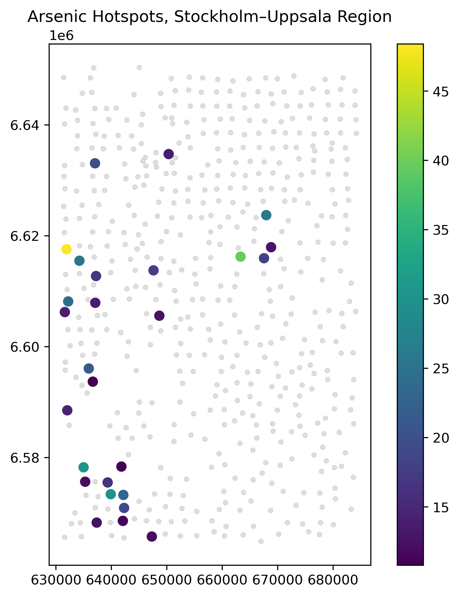

# Geological arsenic occurence in Swedish mmoraine deposits   
### Spatial screening of arsenic hotspots 

---
## Executive Summary

This mini technical project evaluates SGU regional geochemical data to identify elevated arsenic concentrations in Swedish moraine deposits, with focus on the Uppsala–Stockholm region. The purpose is to detect arsenic hotspot zones that may indicate groundwater concern areas. A geospatial screening workflow was developed using arsenic concentration data (`as_ppm`), associated geochemical variables, and GIS groundwater layers. The output consists of hotspot classification maps and groundwater relevance screening overlays designed for early-stage environmental assessment.

---
#calculated ns: 6623528.9, and ew: 656902.4

## 1. Objective

The objective of this project is to identify elevated arsenic hotspot zones in moraine geochemistry data and assess their potential spatial relevance to groundwater-sensitive areas.

### Question
             - Where are arsenic concentrations elevated enough to warrant groundwater attention?

## 2. Data and Study Area

### Study Area

**Uppsala–Stockholm region, Central Sweden**
Estimated geographic coordinates (latitude/longitude) for the Stockholm–Uppsala region and converted them to SWEREF 99 TM. Defined a bounding box (bbox) used as the sampling area.

### Data Source
SGU Regional Geochemistry Dataset (ICP-MS) extracted from **markgeokemi_regional.gpkg**

### Variables Used
- arsenic (`as_ppm`)
- pH
- Fe
- calcium
- geometry
- northing (`ns`)
- easting (`ew`)

## 3. Methodology

### 3.1 Dataset Construction
- Imported SGU geochemical dataset
- Extracted arsenic-related variables
- Subsetted target geographic region

### 3.2 Data Cleaning
Removed:
- missing arsenic values
- duplicate records
- invalid coordinates

Validated:
- arsenic units consistency (ppm)

Converted cleaned dataset into GeoDataFrame.

### 3.3 Hotspot Classification
Arsenic concentrations classified into screening categories:

| Class     | As ppm |
|-----------|--------|
| Low       | ≤ Q1 |
| Typical   | Q1 – Median |
| Elevated  | Median – 95th percentile |
| Hotspot   | > 95th percentile |

Percentile thresholds were calculated directly from dataset distribution.

### 3.4 Spatial Mapping
Generated hotspot concentration map showing:
- all arsenic sample points
- hotspot anomalies highlighted

### 3.5 Groundwater Overlay
Overlay analysis performed using:
- aquifer polygons / groundwater bodies
- arsenic hotspot layer

Purpose:
identify overlap zones where elevated arsenic may affect groundwater-sensitive areas.

---

## 4. Results

**Defined geographic area: Stockholm and Uppsala**

report summary stats and hotspot metrics:
count: 535.00
mean: 3.79 
std: 4.59
min: 0.30
25%: 1.70
50%: 2.30
75%: 3.80
max: 48.40
**unit: as_ppm, dtype: float64**
median 2.30
skewness 4.66
The threshold, hotspot (95th percentile): 10.66 ppm
Number of hotspot samples: 27

### 4.1 Arsenic Hotspot Identification
Hotspot zones represent arsenic concentrations above the 95th percentile threshold and indicate statistically elevated anomaly concentrations.

### 4.2 Spatial Pattern Observations
Analysis identifies:
- clustered arsenic anomaly zones
- localized concentration hotspots rather than uniform distribution

### 4.3 Groundwater Relevance
Overlay mapping highlights:
- hotspot-groundwater intersection areas
- proximity concern zones requiring further screening

---

## 5. Maps Produced

### Map 1 — Arsenic Concentration Hotspot Map
Displays arsenic anomaly concentrations across the study region.

### Map 2 — Hotspot Classification Map
Shows categorized arsenic screening classes.

### Map 3 — Groundwater Relevance Screening Map
Displays overlap between arsenic hotspots and groundwater-sensitive areas.

---

## 6. Interpretation

### Spatial Interpretation
Clustered hotspot patterns suggest localized geological controls rather than diffuse regional enrichment.

### Geological Interpretation
Possible controls include:
- lithological source influence
- redox-sensitive mobilization conditions
- Fe-associated arsenic release pathways

### Groundwater Implication
Hotspot overlap with aquifer zones indicates priority areas for groundwater verification and targeted sampling.

---

## 7. Python Workflow Structure

### Script 1 — `01_build_arsenic_dataset.py`
Tasks:
- import SGU data
- clean records
- create GeoDataFrame

### Script 2 — `02_classify_hotspots.py`
Tasks:
- compute percentiles
- assign hotspot classes

### Script 3 — `03_hotspot_groundwater_map.py`
Tasks:
- create hotspot map
- groundwater overlay map

---

## 8. Software Stack

### Python
- pandas
- geopandas
- matplotlib
- numpy

### GIS
- QGIS

Optional:
- shapely

---

## 9. Deliverables

1. Clean arsenic dataset  
2. Hotspot classified GIS layer  
3. Arsenic hotspot map  
4. Groundwater screening map  
5. Technical report PDF  

---

## 10. Conclusion

