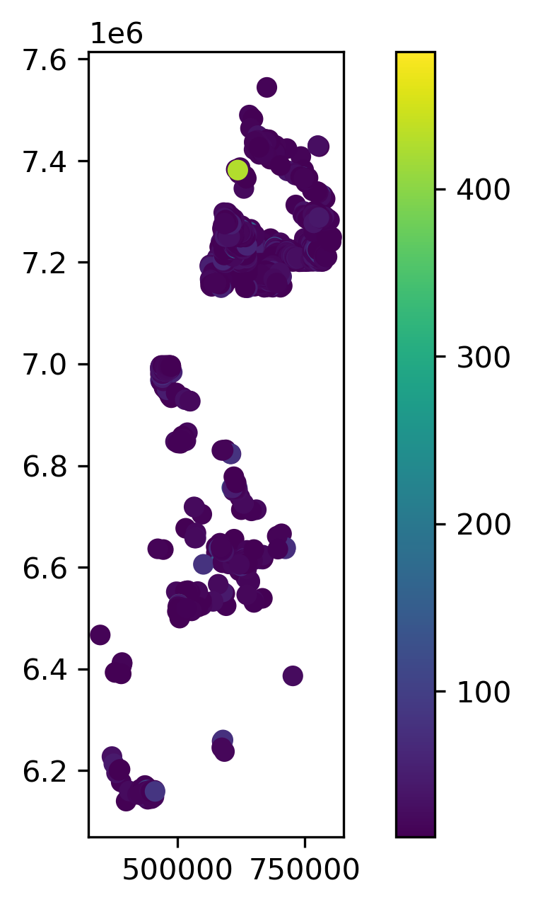

# Geological arsenic hotspots in focus

The mini-project assesses SGU regional geological data to identify geospatial patterns of arsenic occurence in the Swedish moraine. Mapping hotspots of arsenic levels was the focus. 

## Data
## Information on how the work done
Downloade markgeokemi data from SGU. One file "markgeokemi_regional.gpkg" is was large, so was not pushed to the Git rep.
Created Git repository markgeokemi and cloned into my local folder.
### markgeokemi_regional.gpkg File not tracked yet

## Data selection
 
**Core dataset**: 
- moran_0063mm_hno3_icpms HNO3-extractable as (_ppm), for environmental risk screening
- moran_0063mm_totalhalt_xrf as the total (_ppm) as in the soil matrix
- moran_0063mm_ph, pH data
- fe_ppm → arsenic host mineral association

## location id
unikt_id
ns
ew
prov_artal
provtyp
geometry

# Results

## Hotspots

The defined arsenic hotspot- the 95% percentile arsenic concentration is 13.0 ppm,
-95% of samples have arsenic ≤ 13.0 ppm
-top 5% have arsenic > 13 ppm, those top 5% are your hotspot candidates.
Hotspot threshold (95th percentile): 13.00 ppm
Number of hotspot samples: 1419

### summary stats

summary:
count    28077.00
mean         3.71
std          8.42
min          0.10
25%          0.80
50%          1.60
75%          3.80
max        481.90
Name: as_ppm, dtype: float64
 Median 1.60
Skewness 23.12 
Data are highly right-skewed as the skewness is positive. Most swedish morraine samples have low arsenic concentration. and a very small number of samples have elevated concentration.

here mean is much higher than median, mean the median is representable.
It is even clear from the median value of 1.6 ppm vers 481.9

### Arsenic distribution characteristics
The arsenic dataset (n = 28,077) shows a highly right-skewed distribution (skewness = 23.12), indicating that most moraine samples contain low arsenic concentrations, while a limited number of locations exhibit extreme elevated values. The large difference between median (1.60 ppm) and mean (3.71 ppm) confirms the presence of high-value outliers, supporting percentile-based hotspot classification rather than mean-based thresholds.

## Information on how the work done
Downloade markgeokemi data from SGU. One file "markgeokemi_regional.gpkg" is was large, so was not pushed to the Git rep.
Created Git repository markgeokemi and cloned into my local folder.
### markgeokemi_regional.gpkg File not tracked yet

## Now extracted uranium and pH data from **moran_0063mm_ph**

Data cleaned. uranium, there were missing values, removed

Find matching common sample points using **unikt_id**, unikt id kombinerar idnr och idkod 

# Uranium

 
Elevated concrentration of uranium have been measured in the drinking water from private well.
Main concern, radioactivity and mainly toxicity, e.g. kidney.
In the dataset merged with pH values, the measured total uranium concentration in the geological materials ranges between **0.1** and **75.6** ppm.

Within the pH range 6.7-7.8, uranium occurs dominantly in the form of neutrally charged complexes.   
Such U form is common in private drilled well. Possibily Ca2UO2(CO3)30 but as the pH becomes more alkaline, this the CaUO2(CO3)32− forms.

Calcium concentration is a key factor in determining the neutral uranium  Ca2UO2 complexes
The figure below shows relationship between Ca and U on log-log-scale. The relationship is non linear.
- at low to moderate Ca concentrations, around 102-104, U shows wider ranges and highest observed values.
- At high Ca concentrations, above 104-105, U tends to be lower and less variable.
This suggest that at high Ca levels leads to U immobilization or dicrease in dissolved U concetrations. Geochemically, this may indicate:

high Ca favors formation of Ca-uranyl-carbonate complexes,
or high-Ca environments correspond to lithologies/waters with lower uranium mobility or source availability. However, at low Ca ranges, other factors such as pH, organic matter are likely more important.

 ### Arsenic concentration as a function of pH

     

and 

    
